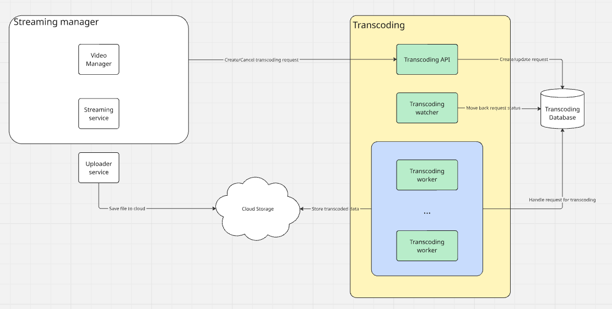
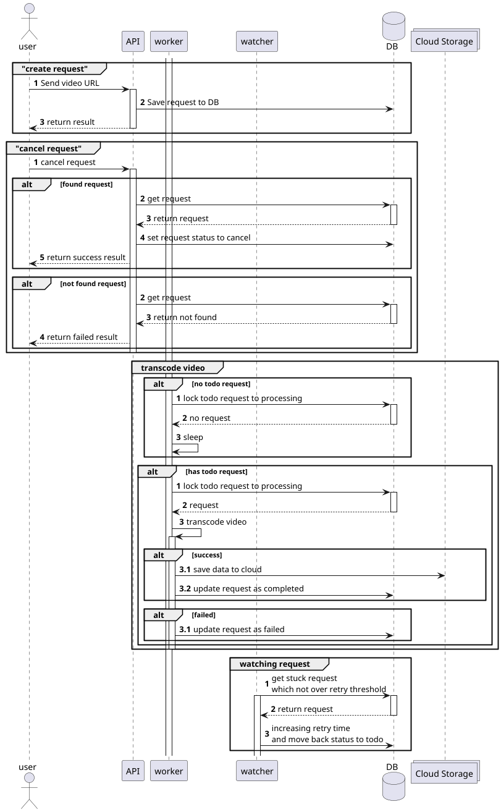

# Andpad Transcode Demo

A Go-based microservice application demonstrating video transcoding capabilities with streaming, message queueing, and cloud storage integration.

## Overview

This project is a demonstration application that showcases a complete media transcoding pipeline using Go. It integrates multiple technologies including Kafka for message queueing, PostgreSQL for data persistence, AWS S3 for object storage, and provides a REST API for managing transcoding jobs.

## Tech Stack

### Core Framework
- **Go 1.26.4** - Main programming language
- **Python 3.12.2** - For local development testing
- **Docker** - Containerization and orchestration
- **Fiber v3** - High-performance web framework for REST API
- **Cobra** - CLI command framework
- **Viper** - Configuration management

### Database & Persistence
- **PostgreSQL** - Primary relational database
- **GORM** - ORM for database operations
- **golang-migrate** - Database migration tool

### Cloud & Storage
- **AWS SDK v2** - AWS services integration
- **S3** - Object storage for media files

## Project Structure

```
├── cmd/              # Command line entry points and main application
├── config/           # Configuration files and settings
├── data/             # Data files and fixtures
├── docker/           # Docker configurations and compose files
├── docs/             # Documentation
├── internal/         # Internal packages (application logic)
├── pkg/              # Public packages (reusable libraries)
├── samples/          # Sample data and examples
├── go.mod & go.sum   # Go module dependencies
├── makefile          # Build and deployment automation
└── README.md         # This file
```

## Getting Started

### Local Development Setup

1. **Install needed app**
   ```bash
   sudo apt update && sudo apt install ffmpeg
   ```

2. **Build the application**
   ```bash
   make tdapp
   ```

3. **Start development environment**
   ```bash
   make local-down && make local-dev-up
   ```
   This starts:
   - PostgreSQL database
   - Database migrations
   - LocalStack (AWS S3 emulation)

4. **Start the full environment**
   ```bash
   make local-down && make local-up
   ```
   This includes all services needed for production-like testing

## API Documentation

The application includes Swagger/OpenAPI documentation. Generate it using:
```bash
make swagger
```

The API is built with Fiber v3 and provides endpoints for managing transcoding jobs and media processing.

## Architecture



### Core flows


### Core Components

- **API Server** - REST API built with Fiber for job management
- **Database Layer** - PostgreSQL with GORM ORM and migration support
- **Cloud Integration** - AWS S3 for media storage and retrieval
- **CLI Tools** - Command-line utilities for administrative tasks

### Data Flow

1. User submits transcoding request via REST API
2. Request is validated and stored in PostgreSQL
3. Worker picks and processes the job asynchronously
4. Media files are stored in S3
5. Status updates are saved to PostgreSQL
6. Results are persisted in database

### Testing
Run tests using Go's standard testing framework:
```bash
go test ./... -count=1 -p=1
```

Run test cases with jupyter notebook:
```bash
make jupyterlab
```